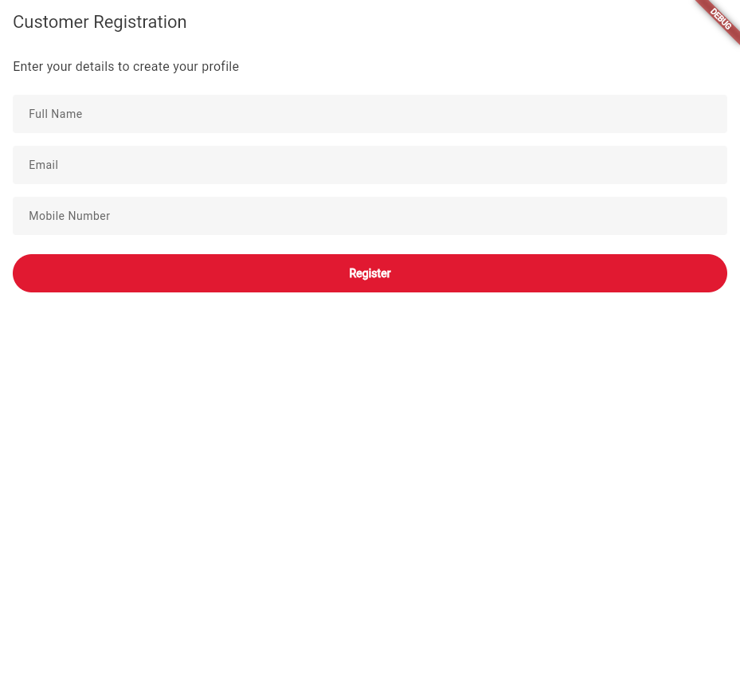
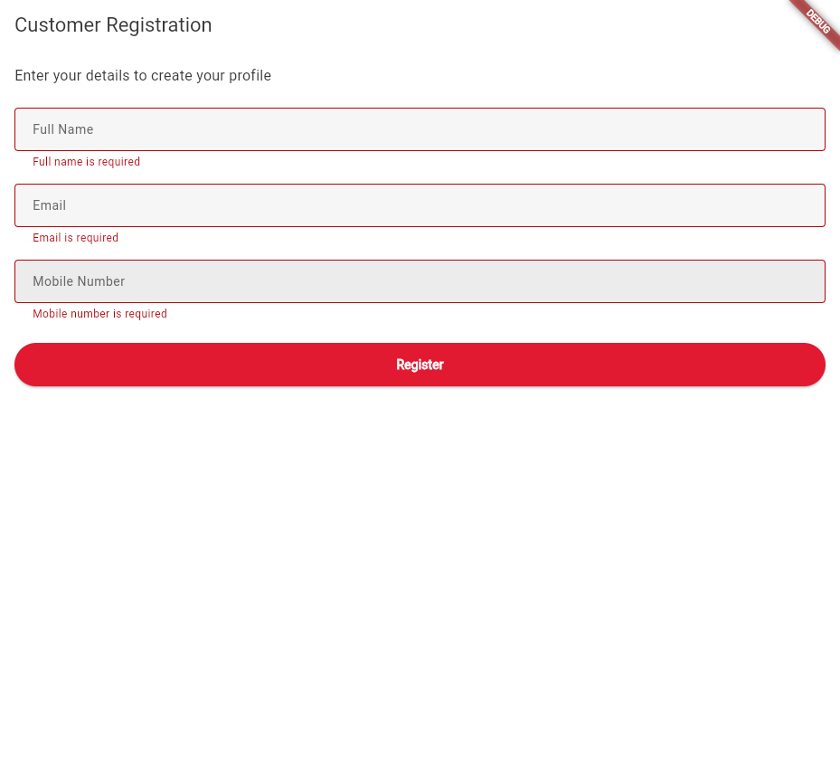
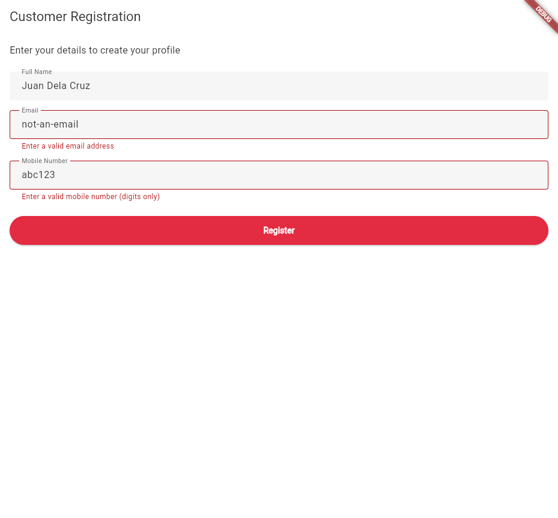
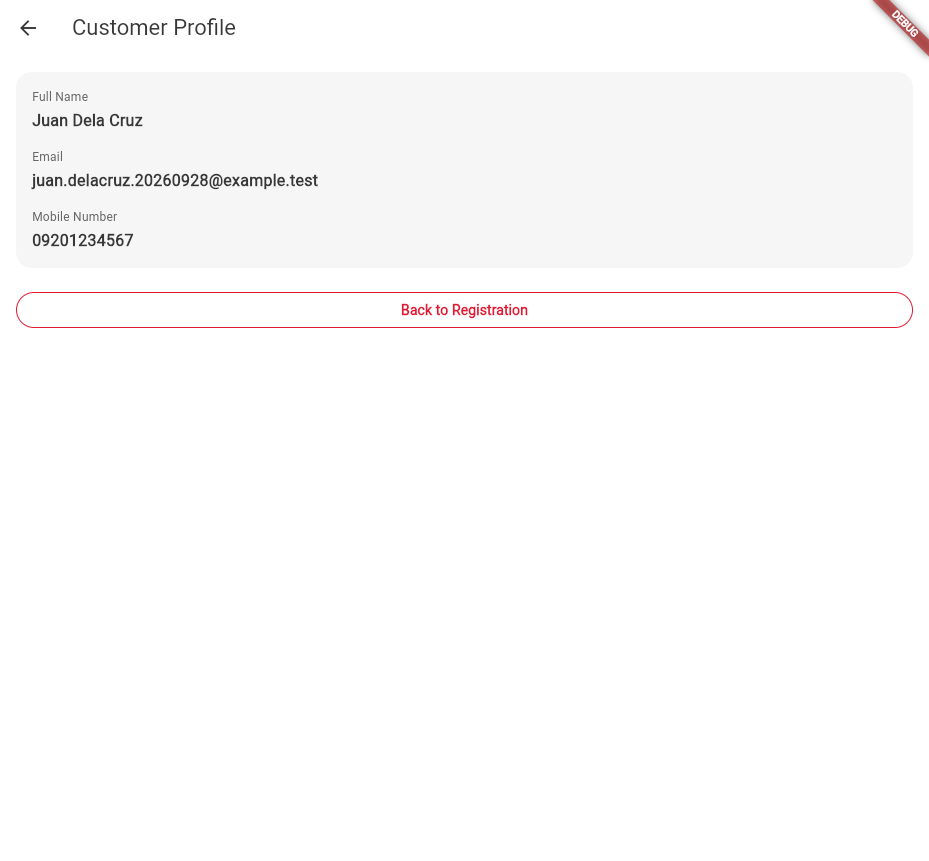
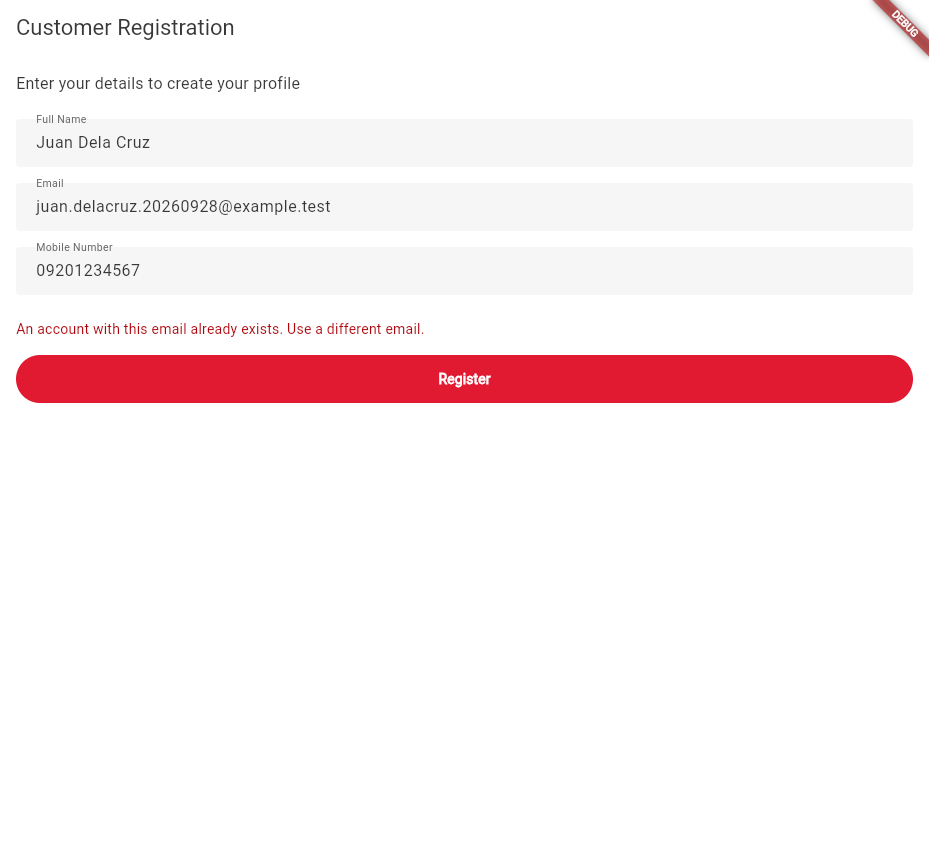

# Exercise results — screenshots and scenarios

This page captures what the Week 1 exercise ([US-01 — Create Customer
Registration](week-1/customer-registration.md) and
[US-02 — View Customer Profile](week-1/customer-model-and-navigation.md))
actually looks like when run, with a screenshot for each scenario in the
acceptance criteria. Every screenshot below was taken against the **live**
local stack — Flutter web UI at `http://127.0.0.1:5100`, Spring Boot backend
at `http://localhost:8080`, and PostgreSQL at `localhost:5432` — not a mock.
Each registration was independently confirmed against the backend via
`GET /api/customers/{id}` (see the "Backend confirmation" note under each
relevant scenario). For the full test matrix and prior automated-test
results, see [Test evidence and scenarios](testing.md).

Screenshot files are stored under [`docs/screenshots/`](screenshots/).

## 1. Registration screen on startup

Acceptance criterion: *"Registration screen appears on startup."* The app
launches directly into `RegistrationScreen` (`MaterialApp.home`) with all
three input fields empty and the Register button enabled.



## 2. Empty required fields (edge case)

Acceptance criterion: *"Required fields are validated."* Pressing **Register**
with every field blank shows a validation message under each field and does
not submit anything to the backend.



| Field | Message shown |
|---|---|
| Full Name | `Full name is required` |
| Email | `Email is required` |
| Mobile Number | `Mobile number is required` |

## 3. Invalid email and mobile number format (edge case)

Acceptance criterion: *"Required fields are validated"* extended to format,
not just presence. `not-an-email` and `abc123` are both rejected client-side
before any request reaches the backend.



| Field | Input | Message shown |
|---|---|---|
| Email | `not-an-email` | `Enter a valid email address` |
| Mobile Number | `abc123` | `Enter a valid mobile number (digits only)` |

## 4. Successful registration → Customer Profile (normal flow)

Acceptance criteria: *"Successful registration shows the entered customer
name"*, *"Successful registration navigates to Profile"*, and *"The exact
submitted information is displayed."* Submitting valid details
(`Juan Dela Cruz` / `juan.delacruz.20260928@example.test` / `09201234567`)
sends `POST /api/customers`, which returned **HTTP 201**. The screen then
navigated to Customer Profile displaying exactly what was submitted.



**Backend confirmation** — a direct `GET /api/customers/5` (the ID the
backend generated for this registration) returned the identical record,
proving the customer was actually persisted in PostgreSQL and not just held
in the Flutter widget tree:

```json
{
  "id": 5,
  "fullName": "Juan Dela Cruz",
  "email": "juan.delacruz.20260928@example.test",
  "mobileNumber": "09201234567"
}
```

A second registration earlier in this same session (`Maria Santos`,
`maria.santos.20260928@example.test`, `09171234567`) was verified the same
way at `id=4`, confirming this isn't a one-off result.

## 5. Duplicate email (backend error, edge case)

Acceptance criteria beyond the Week 1 brief but exercised as part of the
integration: the backend rejects a second registration with an email that
already exists, and the Flutter UI must surface that failure instead of
silently failing or navigating away. Resubmitting the same
`juan.delacruz.20260928@example.test` a second time produced
**HTTP 409 Conflict** from the backend, which the UI displayed as a specific,
actionable message while remaining on the registration screen (not
navigating to Profile, and not losing the entered data).



Network trace for this session, confirming the exact status codes:

```
POST http://localhost:8080/api/customers  → 201  (scenario 4, first submission)
POST http://localhost:8080/api/customers  → 409  (scenario 5, duplicate email)
```

## Widget tree exercised by these screenshots

```text
MyApp
└── MaterialApp
    └── RegistrationScreen (StatefulWidget)
        └── Scaffold
            ├── AppBar — "Customer Registration"
            └── Form
                └── Column
                    ├── Text — instructions
                    ├── AppTextField — Full Name
                    ├── AppTextField — Email
                    ├── AppTextField — Mobile Number
                    ├── [error Text — shown in scenarios 2, 3, 5]
                    └── AppPrimaryButton — Register
```

On success, `Navigator.push` replaces the visible screen with:

```text
ProfileScreen (StatelessWidget, receives Customer via constructor)
└── Scaffold
    ├── AppBar — "Customer Profile"
    └── Column
        ├── AppCard (Full Name / Email / Mobile Number)
        └── OutlinedButton — "Back to Registration" (Navigator.pop)
```

## How to reproduce

1. Start Postgres, the backend, and the Flutter web UI — see
   [Local development](local-development.md), or run
   `skills/home-debit/scripts/start-local.ps1` from the `home-debit` skill.
2. Open `http://127.0.0.1:5100/` in a browser.
3. Follow scenarios 1–5 above in order, using a unique synthetic email (e.g.
   include a date or GUID) so a fresh run doesn't collide with a prior
   record — reusing the same email on a second run is exactly how scenario 5
   was produced deliberately.
4. Confirm persistence directly with
   `Invoke-RestMethod http://localhost:8080/api/customers/{id}` using the ID
   from the registration response.

## Sources

* [Registration screen](../lib/screens/registration_screen.dart)
* [Profile screen](../lib/screens/profile_screen.dart)
* [Customer service](../lib/services/customer_service.dart)
* [Customer API](backend/customer-api.md)
* [Test evidence and scenarios](testing.md)

# Citations

[1][Week 1 training brief](../../../../Downloads/Flutter_4_Week_Training_Developer_Week_1.docx)
[2][Registration screen implementation](../lib/screens/registration_screen.dart)
[3][Live screenshots](screenshots/)
