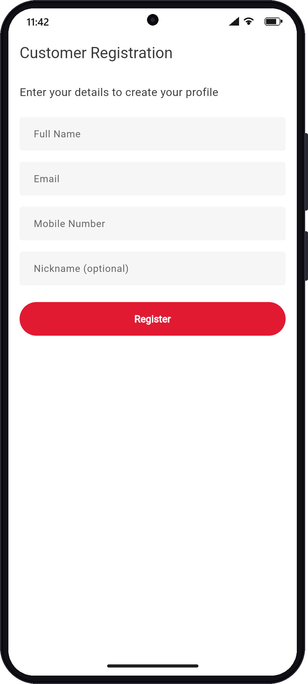
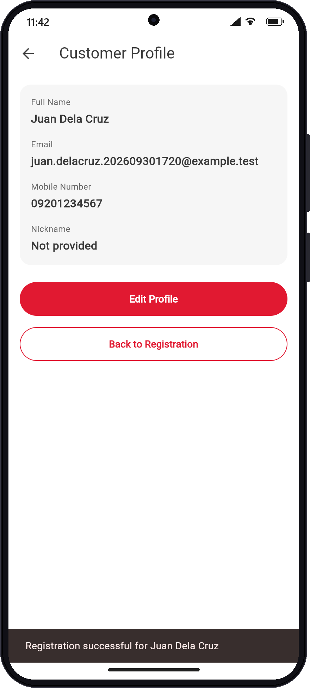
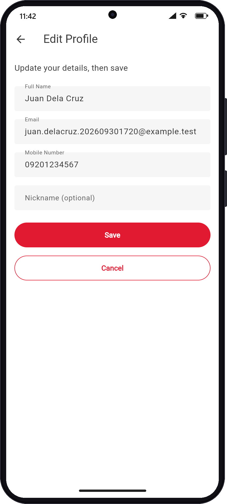
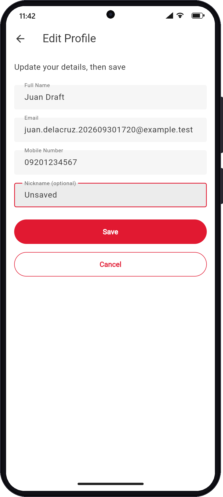
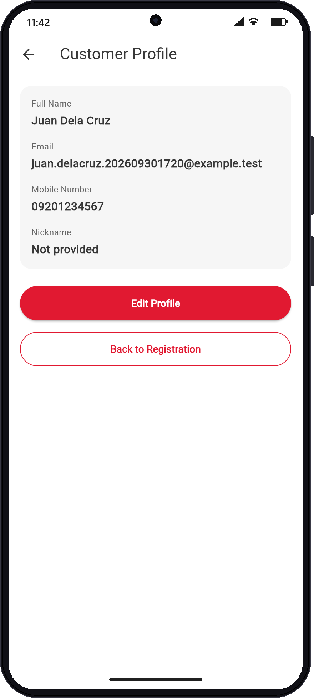
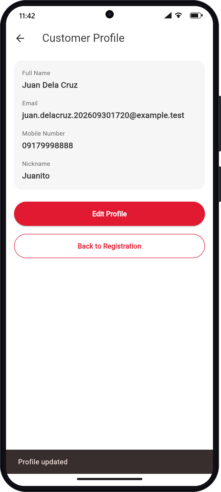
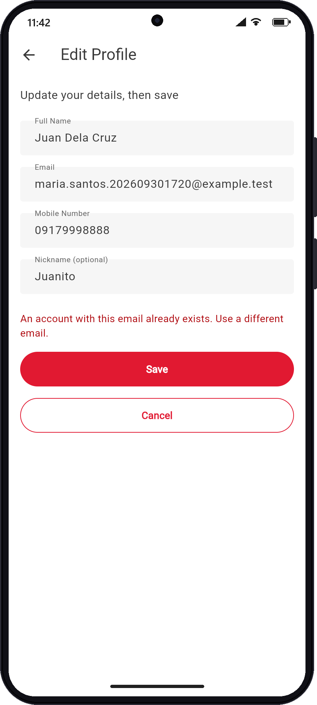
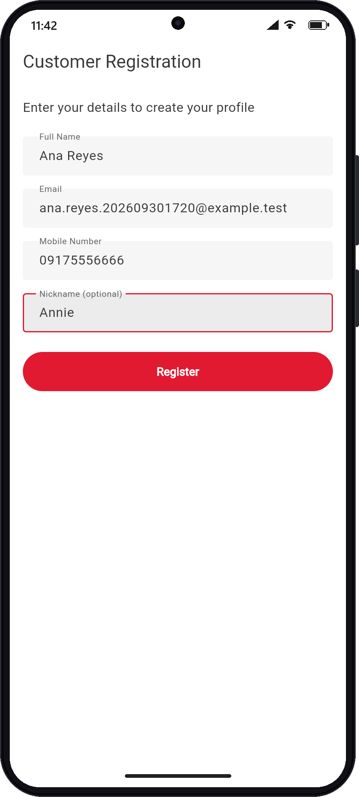
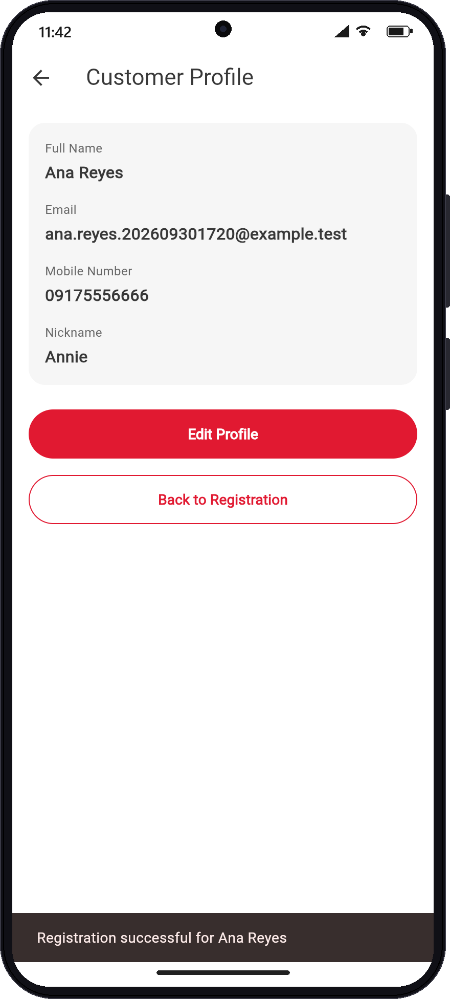

# Week 2 exercise results — screenshots and scenarios

Every screenshot below was captured on **2026-09-30** against the **live**
local stack — Flutter web UI `http://127.0.0.1:5100`, Spring Boot
`http://localhost:8080`, PostgreSQL `localhost:5432` — by a scripted browser
at a Pixel-class viewport (412×892 CSS px, 2×) and composed into an Android
frame. The frame is cosmetic; the screen content is the real app. Test data
uses the stamp `202609301720` so reruns never collide.

Story guides: [US-03 — Optional customer information](week-2/optional-customer-information.md)
· [US-04 — Edit customer profile](week-2/edit-customer-profile.md).
Full automated matrix: [Test evidence and scenarios](testing.md).

## Scenario summary

| # | Story | Scenario | Result |
|---|---|---|---|
| 1 | US-03 | Registration shows an optional Nickname field | Pass |
| 2 | US-03 | Register **without** nickname → Profile shows `Not provided` | Pass — `nickname: null` in DB |
| 3 | US-04 | Edit opens with the existing values | Pass |
| 4 | US-04 | Type changes (unsaved draft) | Pass |
| 5 | US-04 | **Cancel** → Profile unchanged, nothing sent | Pass — DB row unchanged |
| 6 | US-04 | **Save** → Profile shows updated values | Pass — `PUT` 200, DB row updated |
| 7 | US-04 | Save with another customer's email → `409`, stays on Edit | Pass — DB row unchanged |
| 8–9 | US-03 | Register **with** nickname → Profile shows it | Pass — `nickname: "Annie"` in DB |

## 1. Optional Nickname on registration (US-03)

The form now has a fourth field, **Nickname (optional)**. It has no
"required" rule; leaving it empty is valid.



## 2. No nickname → fallback (US-03, null case)

Registered `Juan Dela Cruz` / `juan.delacruz.202609301720@example.test` /
`09201234567` with the nickname left empty. The UI sent `"nickname": null`;
the backend stored `NULL`; the profile rendered the `??` fallback — no crash.



## 3. Edit opens with existing values (US-04)

**Edit Profile** pushes `EditProfileScreen`, whose controllers are seeded from
the profile. The null nickname becomes an empty field (`nickname ?? ''`).



## 4–5. Unsaved changes, then Cancel (US-04)

Changed the name to `Juan Draft` and the nickname to `Unsaved`, then pressed
**Cancel**. The route popped with no result, the draft was discarded, and the
profile still shows the saved values — including `Not provided`. No `PUT` was
sent.

| Draft (unsaved) | After Cancel |
|---|---|
|  |  |

## 6. Save updates the Profile (US-04)

Re-opened Edit, changed the mobile to `09179998888` and the nickname to
`Juanito`, pressed **Save**. `PUT /api/customers/17` returned `200`; the edit
screen popped with the saved customer and the profile rebuilt with
`Profile updated`.



## 7. Duplicate email on Save (US-04, edge case)

A second customer (`Maria Santos`, `id=16`) was created first. Changing
Juan's email to hers and pressing Save returned **`409 Conflict`**. The edit
screen stayed open, kept the draft, and showed the error. Cancel then
returned to the profile with his own email intact.



## 8–9. Nickname provided at registration (US-03, non-null case)

From a fresh app start, registered `Ana Reyes` /
`ana.reyes.202609301720@example.test` / `09175556666` with nickname `Annie`.

| Form | Profile |
|---|---|
|  |  |

## Backend confirmation

`GET /api/customers/{id}` after the run — the persisted rows match the final
UI state, **not** the cancelled draft and **not** the rejected email:

```json
{"id":16,"fullName":"Maria Santos","email":"maria.santos.202609301720@example.test","mobileNumber":"09181112222","nickname":null}
{"id":17,"fullName":"Juan Dela Cruz","email":"juan.delacruz.202609301720@example.test","mobileNumber":"09179998888","nickname":"Juanito"}
{"id":18,"fullName":"Ana Reyes","email":"ana.reyes.202609301720@example.test","mobileNumber":"09175556666","nickname":"Annie"}
```

```text
docker exec home-debit-postgres psql -U home_debit -d home_debit \
  -c "SELECT id, full_name, email, mobile_number, nickname FROM customer WHERE email LIKE '%202609301720%';"
```

Flyway history on the live database shows `2 | add customer nickname | t`.

## How to reproduce

1. Start the stack — [Local development](local-development.md), or the
   `home-debit` skill's `start-local.ps1`.
2. Open `http://127.0.0.1:5100/` and follow scenarios 1–9 with a fresh dated
   email (a reused email gives `409` at registration).
3. For scenario 7, register a second customer first (UI or `POST`) and use
   their email.
4. Confirm with `Invoke-RestMethod http://localhost:8080/api/customers/{id}`.

## Sources

* [Registration screen](../lib/screens/registration_screen.dart)
* [Profile screen](../lib/screens/profile_screen.dart)
* [Edit profile screen](../lib/screens/edit_profile_screen.dart)
* [Customer API](backend/customer-api.md)

# Citations

[1][Week 2 training brief](../../home-debit/Flutter_4_Week_Training_Developer_Week_2%201.docx)
[2][Live screenshots](screenshots/)
