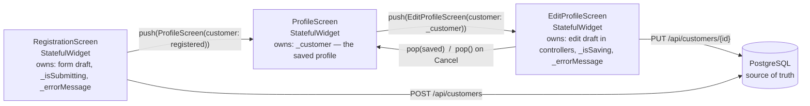

# Edit customer profile (US-04)

> **Business story:** As a customer, I want to edit my profile so that I can
> correct information I entered previously.

## What was built

| Layer | Change |
|---|---|
| Backend API | `PUT /api/customers/{id}` replaces full name, email, mobile number, and nickname. Same validation as registration → `400`; unknown id → `404`; email owned by **another** customer → `409` (keeping your own email is fine). CORS now allows `PUT`. |
| Service | `CustomerService.update(Customer)` sends the `PUT`, maps `200` back to a `Customer`, and maps `400/404/409`/network failures to user-facing messages. |
| Profile | Now a `StatefulWidget` that **owns the current saved customer**. New **Edit Profile** button; after a successful save it replaces its customer with `setState` and shows `Profile updated`. |
| Edit screen | New `EditProfileScreen` — four `TextEditingController`s pre-filled from the current profile, **Save** and **Cancel**. |
| Shared UI | `AppSecondaryButton` (Cancel / Back) and `AppErrorMessage` (form-level errors) replace raw Material controls in screens; `CustomerValidators` is shared by Registration and Edit. |

## Acceptance criteria → evidence

| Acceptance criterion | Where it is satisfied | Proof |
|---|---|---|
| Edit screen opens with existing values | `EditProfileScreen.initState` seeds each controller from `widget.customer` | Widget test *Edit opens with the existing values*; live screenshot 03 |
| User can modify profile information | Name, email, mobile, nickname are editable `AppTextField`s with the same validators as registration | Widget test *invalid edits show validation errors*; screenshot 04 |
| Save updates the displayed Profile | Save → `PUT` → `Navigator.pop(context, saved)` → `ProfileScreen` `setState(() => _customer = updated)` | Widget test *Save sends PUT and the Profile shows the updated values*; screenshot 06; database row confirmed |
| Cancel leaves the existing Profile unchanged | Cancel → `Navigator.pop(context)` (result `null`) → Profile ignores it; no request is sent | Widget test *Cancel discards unsaved changes and sends nothing*; screenshot 05 |
| Explain where state is owned | See "Where state lives" | — |
| Justify Stateless vs Stateful choices | See "Widget choices" | — |

## Where state lives

The rule applied: **state lives in the lowest widget that needs to change
it, and data flows down while results flow back up.**

* **The saved profile is owned by `ProfileScreen`.** It is the screen that
  displays it and the only one that needs to *replace* it after an edit. It
  receives the initial customer from Registration through its constructor,
  copies it into `late Customer _customer` in `initState`, and from then on
  its own state is authoritative.
* **The unsaved draft is owned by `EditProfileScreen`** — in its
  `TextEditingController`s, not in the `Customer`. `Customer` is immutable; the
  edit screen never mutates the profile's object, it builds a **new**
  `Customer` from the controllers when you press Save.
* **The database is the source of truth.** Save does not hand the draft back
  to the profile; it hands back what the **backend returned** from `PUT`, so
  the profile shows persisted data (the same principle as Week 1's
  registration).

### What happens to unsaved changes?

(The end-of-week challenge question.) They live only in the edit screen's
controllers. **Cancel** — or the system back arrow — pops the route with no
result (`null`). The edit screen's `State` is disposed, its `dispose()`
disposes all four controllers, and the draft is gone. `ProfileScreen` sees
`updated == null` and returns early, so its `_customer` — and the database —
are untouched. Re-opening Edit starts again from the saved profile, which
the *Cancel discards unsaved changes* test checks explicitly.

If **Save fails** (e.g. `409` — the email belongs to someone else), the edit
screen stays open, keeps the draft so the user can fix it, and shows the
error. Nothing on the profile changes until a save succeeds.

While a save is **in flight**, leaving is blocked: Cancel is disabled, the
AppBar back arrow is hidden, and the screen is wrapped in
`PopScope(canPop: !_isSaving)` so the system back gesture is ignored. Without
this, the route could pop with `null` while the `PUT` still commits — the
profile would show stale data, and the next Save (which sends every field)
would silently revert the change. This was found in code review.

## Widget choices

| Widget | Type | Why |
|---|---|---|
| `RegistrationScreen` | `StatefulWidget` | Owns controllers, a loading flag, and an error that change over time. |
| `ProfileScreen` | `StatefulWidget` *(was Stateless in Week 1)* | In Week 1 it only rendered constructor input, so Stateless was correct. US-04 makes the displayed customer **change after it's built** — that is state, so it must be Stateful. Keeping it Stateless would need a parent to own the customer and rebuild it, pushing state further up than it needs to be. |
| `EditProfileScreen` | `StatefulWidget` | Owns controllers (which must be created once and disposed), `_isSaving`, `_errorMessage`. |
| `AppTextField`, `AppPrimaryButton`, `AppSecondaryButton`, `AppErrorMessage`, `AppCard`, `AppLabelValue` | `StatelessWidget` | Pure functions of their constructor arguments. The *controller* passed to `AppTextField` is owned by the screen, not the field. |

Stateless is the default; a widget becomes Stateful only when **it** must hold
data that changes during its lifetime.

## `setState`, controllers, and navigation results

* **`setState`** tells Flutter this `State` changed and `build` must run again.
  It's used for `_isSaving`/`_errorMessage` on Edit and for replacing
  `_customer` on Profile. The typed text is *not* put through `setState` —
  `TextEditingController` already notifies its `TextFormField`.
* **`TextEditingController`** is created in `initState` with the current value
  (`TextEditingController(text: customer.fullName)`) and disposed in
  `dispose()`. Creating it in `build` would reset the user's typing on every
  rebuild.
* **Returning a result:** `Navigator.push<Customer>(…)` returns a
  `Future<Customer?>` that completes when the route pops. Save pops with the
  saved customer; Cancel pops with nothing. The `?` in `Customer?` is null
  safety doing its job — the profile *must* handle "no result".
* **`mounted` checks** after every `await` are a safety net: the screen never
  calls `setState`/`Navigator` after it is disposed.
* A lingering "Registration successful" `SnackBar` is dismissed when Edit
  opens and replaced by "Profile updated" after a save — found by the widget
  tests, where the old SnackBar was covering the Cancel button.

## Tests

* `test/profile_edit_test.dart` (`US-04` group) — prefilled values (with and without nickname), Save → `PUT` body/URL and updated profile, clearing nickname restores `Not provided`, Cancel sends nothing and restores saved values on re-open, validation blocks Save, `409` keeps the user on Edit and Cancel leaves the profile unchanged, back navigation is blocked while Save is in progress.
* `test/customer_service_test.dart` (`update` group) — `PUT` URL/body/headers, `200` mapping, no-id guard, `409`, `404`, `400` detail, network failure.
* `CustomerControllerTests` — update persists all fields, blank nickname clears it, keeping own email is allowed, another customer's email → `409` (and the row is unchanged), invalid fields → `400`, unknown id → `404`, `PUT` CORS preflight.

## Sources

* [Edit profile screen](../../lib/screens/edit_profile_screen.dart)
* [Profile screen](../../lib/screens/profile_screen.dart)
* [Customer service](../../lib/services/customer_service.dart)
* [Customer API](../backend/customer-api.md)
* [Week 2 exercise results](../week-2-exercise-results.md)

# Citations

[1][Week 2 training brief](../../../home-debit/Flutter_4_Week_Training_Developer_Week_2%201.docx)
[2][Edit profile screen](../../lib/screens/edit_profile_screen.dart)
[3][Customer service update](../../../home-debit/src/main/java/ph/hcph/homedebit/customer/CustomerService.java)
